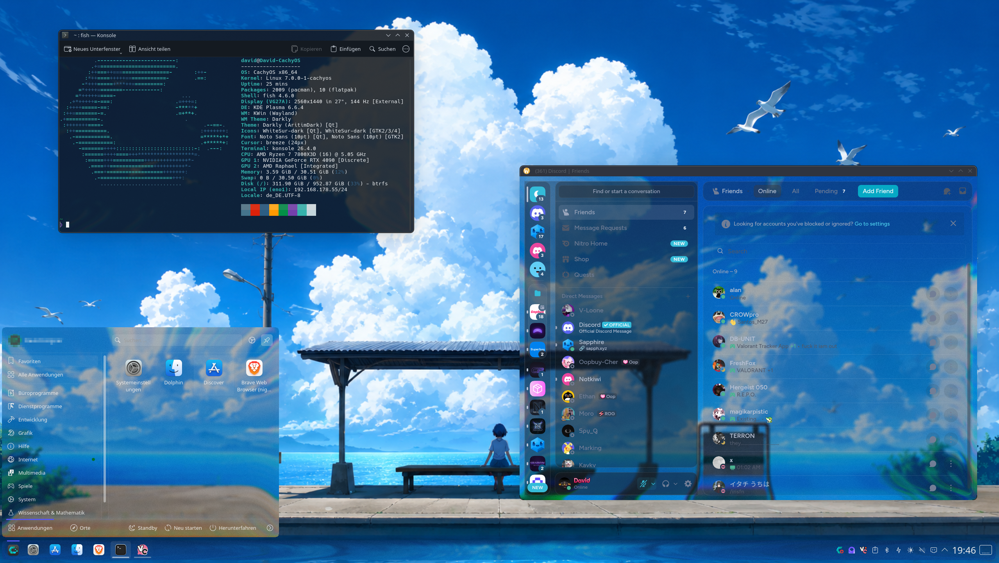
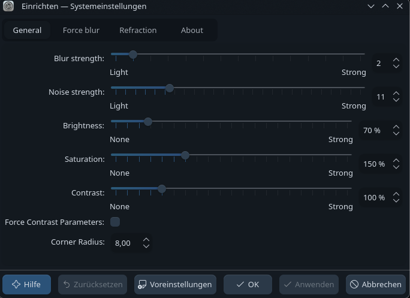
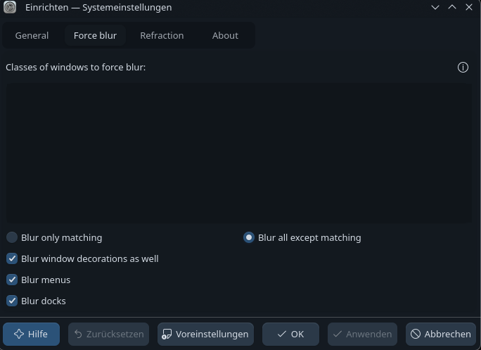
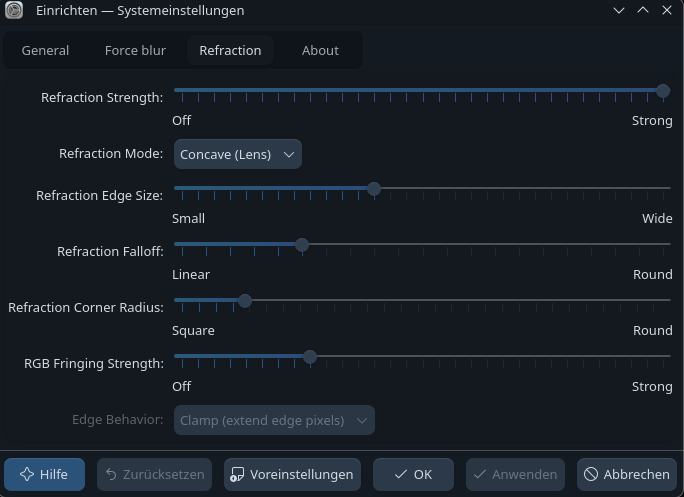

A glossy **KDE Plasma Liquid Glass theme/rice** inspired by the macOS Tahoe / Liquid Glass look.

Built for KDE Plasma with blur, transparency, rounded corners, modified Layan files and a custom Discord/Vesktop theme.

---

## 🖼️ Preview



---

## ✨ Features

- 💎 Liquid Glass inspired KDE Plasma look
- 🌫️ Strong blur with Better Blur DX
- 🔘 Rounded window corners
- 🪟 Borderless window decorations
- 🧊 Modified transparent Layan Plasma theme
- 🌑 Dark glassy color setup
- 💬 Included modified Discord/Vesktop theme
- 🦊 Works nicely with transparent Firefox/UserChrome setups

---

## 📁 Repository Structure

| Folder | Description |
|---|---|
| `screenshots/` | Preview and settings screenshots |
| `themes/modified-layan/` | Modified Layan Plasma theme files |
| `themes/discord-theme/` | Modified Discord/Vesktop theme |
| `Darkly/` | Linked Darkly repository |
| `BreezeEnhanced/` | Linked BreezeEnhanced repository |
| `WhiteSur-icon-theme/` | Linked WhiteSur icon theme repository |
| `Layan-kde/` | Linked Layan KDE repository |
| `Better-Blur-DX/` | Linked Better Blur DX repository |
| `KDE-Rounded-Corners/` | Linked KDE Rounded Corners repository |

---

## 🧩 Components

| Part | Theme / Tool |
|---|---|
| 🎨 Application Style | [Darkly](./Darkly) |
| 🌑 Colors | Artim Dark / edited Breeze Dark |
| 🪟 Window Decorations | [BreezeEnhanced](./BreezeEnhanced) |
| 🧊 Icons | [WhiteSur Icon Theme](./WhiteSur-icon-theme) |
| 💎 Plasma Style | [Layan KDE](./Layan-kde) + modified files |
| 🌫️ Blur | [Better Blur DX](./Better-Blur-DX) |
| 🔘 Rounded Corners | [KDE Rounded Corners](./KDE-Rounded-Corners) |
| 💬 Discord / Vesktop | Modified Midnight theme |

---

## 📦 Installation

### 1. Clone the repository

```bash
git clone --recurse-submodules https://github.com/david-x3d/kde-plasma-liquid-glass-theme.git
cd kde-plasma-liquid-glass-theme
```

If you already cloned it without submodules:

```bash
git submodule update --init --recursive
```

---

## 💎 Install Modified Layan Theme

First install the normal Layan Plasma theme.

Then copy the modified files from this repo into your local Layan theme folder:

```bash
mkdir -p ~/.local/share/plasma/desktoptheme/Layan
cp -r themes/modified-layan/* ~/.local/share/plasma/desktoptheme/Layan/
```

After that, open KDE settings and reselect/reload the Plasma theme.

---

## 💬 Install Discord / Vesktop Theme

The modified Discord theme is located here:

```txt
themes/discord-theme/modified-midnight.theme.css
```

Use it with Vesktop or another Discord client that supports custom CSS/themes.

Recommended setup:

- Vesktop
- Midnight theme base
- background layer removed/disabled
- transparent background
- Better Blur DX handles the blur behind the window

---

## ⚙️ KDE Settings

| Setting | Value |
|---|---|
| Application Style | Darkly |
| Colors | Artim Dark / edited Breeze Dark |
| Window Decorations | BreezeEnhanced |
| Icons | WhiteSur-dark |
| Plasma Style | Modified Layan |
| Window Manager | KWin Wayland |
| Effects | Better Blur DX + Rounded Corners |

---

## 🪟 Borderless Window Rule

For BreezeEnhanced, create a window rule matching:

```txt
.*
```

Use it to remove visible window borders for the full glass look.

---

## 🌫️ Better Blur DX Settings

Recommended tweaks:

- disable shadows
- increase blur strength
- darken the glass slightly
- use darker wallpapers
- avoid pure white backgrounds

### Settings Screenshots

<p align="center">
  
  
  
</p>

---

## 🖼️ Wallpaper Tips

This setup works best with:

- dark city wallpapers
- blue / purple wallpapers
- glassy abstract wallpapers
- night skyline wallpapers
- darker cyberpunk wallpapers

Bright wallpapers can make text harder to read.

---

## ⭐ Support

If you like this setup, feel free to star the repo.
